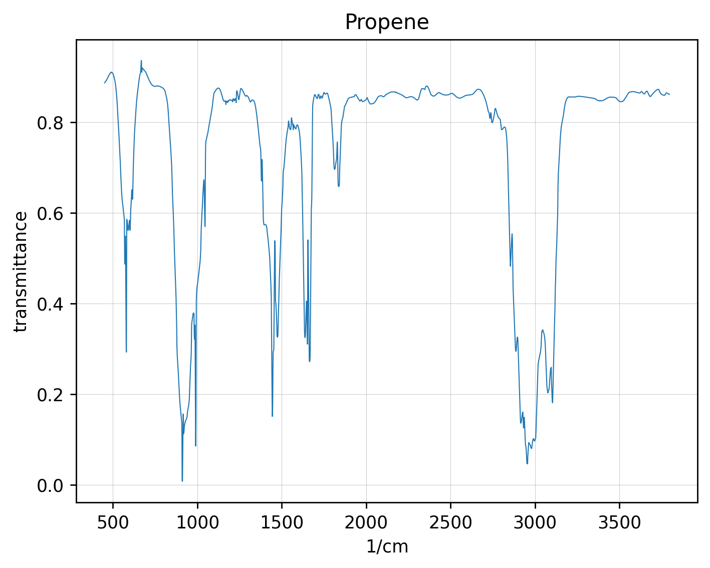
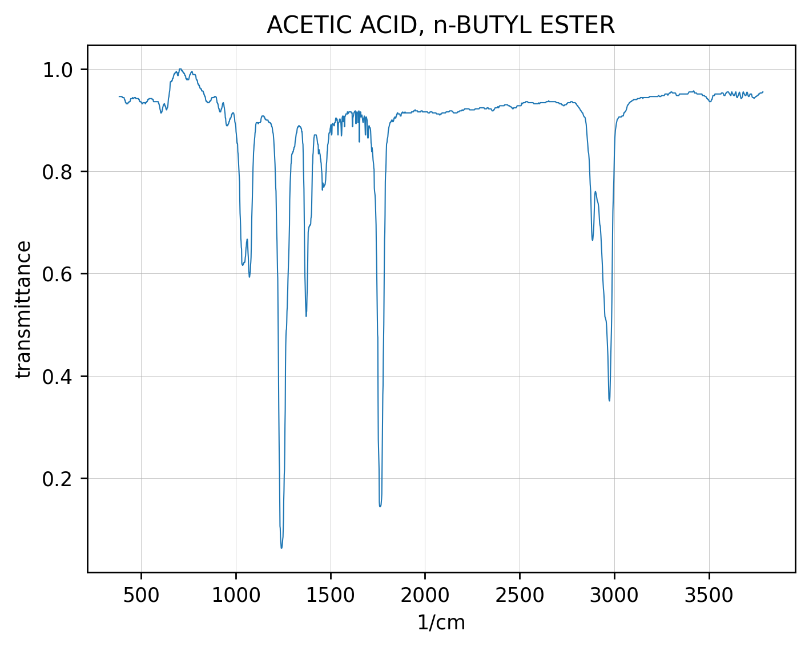

###### JDX Spectroscopy File Dumper 
    
    This is a simple Python script that dumps the contents of one or more
    .jdx/.JDX spectroscopy file(s) to a set of 3 files: (1) a text file with header data
    (2) converted spectroscopy data (3) a PNG plot of the spectrum.  

###### GENERAL USAGE

    To use, pass in either a .jdx filename with -f (-filename) flag OR
    a directory with multiple .jdx/.JDX files (-d, --directory).

    Optional argument include -o (output directory), get the help message (-h),
    get the version (-v, --version), or -u (--usage, -u).

    usage: jdx_dump.py [-h] [-f FILENAME] [-d DIRECTORY] [-o OUTDIR] [-v] [-u]

    jdx conversion/dumper tool.

    optional arguments:
    -h, --help            show this help message and exit
    -f FILENAME, --filename FILENAME
                        jdx filename
    -d DIRECTORY, --directory DIRECTORY
                        input directory
    -o OUTDIR, --outdir OUTDIR
                        output directory
    -v, --version         show version.
    -u, --usage           show usage message.

###### EXAMPLES USAGE/HOW TO RUN
 
    It is expected that you will have a Python3 installation on your system. To run this script,
    one can either pass in a directory containing .jdx/.JDX files OR a single .jdx/.JDX file. You can
    also pass in an output directory.

    Examples: 
    $ python3 jdx_dump.py --version
    Version: 1.0.0    
 
    Run with an input directory (sample files provided in inputs/ directory in repo.):
    $ python3 jdx_dump.py -d inputs/ 
 
    Run with single file, and send outputs to current directory:
    $ python3 jdx_dump.py -f inputs/693-07-2-IR.jdx -o $(pwd) 

###### Sample Images
 
    (1) IR Spectra Propene: 

    (2) Acetic Acid / Butyl Ester 

###### VERSION
    
    Version 1.0.0

###### 3rd party Python libraries used

    The required 3rd-party Python libraries are required:

    numpy - for array manipulation and matrix computations 
    matplotlib - for creating contour objects to be used in creating KMLs with isolines
    jcamp - to read .jdx/.JDX spectroscopy file
    Pathlib - for writing output file(s)

###### PYTHON VERSION:
     
    Supports Python 3.8.10+
